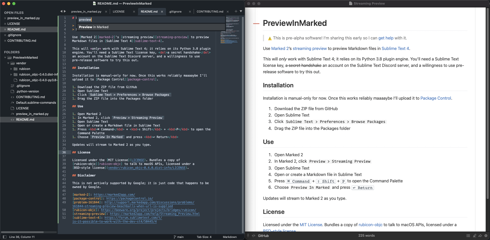

# PreviewInMarked

> :warning: This is pre-alpha software! It has seen a few hours of use, tops;
> expect a bumpy ride if you install it now.



Use [Marked 2][marked-2]'s [streaming preview][streaming-preview] to preview
Markdown files in [Sublime Text 4][sublime-text-4].

This will *only* work with Sublime Text 4; it relies on its Python 3.8 plugin
engine. You'll need a Sublime Text license key, <del>a secret handshake</del>
an account on the Sublime Text Discord server, and a willingness to use
pre-release software to try this out.

## Installation

Installation is manual-only for now. Once this works reliably maaaaybe I'll
upload it to [Package Control][package-control].

1. Download [the code][the-code] from GitHub
1. Open Sublime Text
1. Click `Sublime Text > Preferences > Browse Packages`
1. Drag the ZIP file into the Packages folder

## Use

1. Open Sublime Text
1. Open or create a Markdown file in Sublime Text
1. Press <kbd>⌘ Command</kbd> + <kbd>⇧ Shift</kbd> + <kbd>P</kbd> to open the
   Command Palette
1. Choose `Preview In Marked` and press <kbd>↩︎ Return</kbd>

Updates will stream to Marked 2 as you type.

## Configuration

PreviewInMarked is configurable with the usual
`Packages/User/PreviewInMarked.sublime-settings` file. There's one setting,
which controls the refresh frequency for previews; by default, it's:

```jsonc
{
   // Stream at most one update to Marked every `debounce_seconds`.
   "debounce_seconds": 1.0
}
```

## License

Licensed under the [Apache-2.0 License](LICENSE). Bundles a copy of
[rubicon-objc][rubicon-objc] to talk to macOS APIs, licensed under a 
[BSD-style license](third_party/rubicon/LICENSE).

## Disclaimer

This is not actively supported by Google; it is just code that happens to be
owned by Google.

[the-code]: /willangley/PreviewInMarked/archive/main.zip

[marked-2]: https://marked2app.com/
[package-control]: https://packagecontrol.io/
[rubicon-objc]: https://beeware.org/project/projects/bridges/rubicon/
[streaming-preview]: https://marked2app.com/help/Streaming_Preview.html
[sublime-text-4]: https://forum.sublimetext.com/t/is-it-possible-to-work-with-the-dev-st4/50445/4
